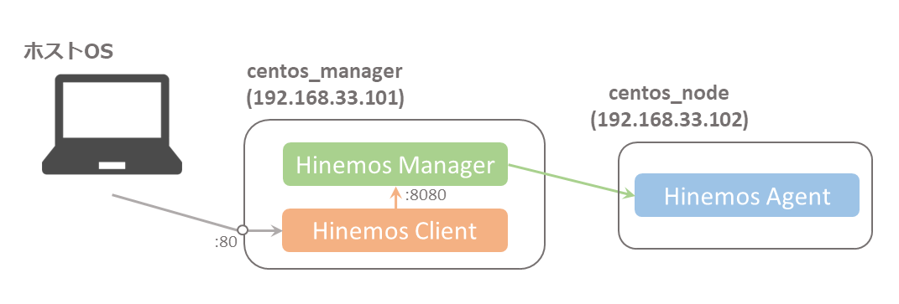

# 概要
* Hinemos6.1 チュートリアルを実施するための環境構築コード

	https://www.hinemos.info/technology/nttdata/2018040301

* VirtualBox を用いて仮想サーバを構築する
* IPアドレスはチュートリアルと異なるので、適宜読み替える

# 環境
## Linux サーバ一覧


| ホスト名 | OS | IPアドレス | 用途 |
| :- | :- | :- | :- |
| centos_manager | CentOS7 | 192.168.33.101 | Hinemosマネージャ・Webクライアントをインストール |
| centos_node | CentOS7 | 192.168.33.102 | Hinemosエージェントをインストール、監視対象サーバ |


# インストール方法

## 事前準備

### VirtualBox のインストール
* VirtualBox をインストール

	https://www.virtualbox.org/wiki/Downloads

### Vagrant のインストール
* Vagrant をインストール

	https://www.vagrantup.com/downloads.html

	```
	$ vagrant -v
	```
* Vagrant プラグインをインストール

	```
	$ vagrant plugin install vagrant-hosts
	$ vagrant plugin install vagrant-reload
	$ vagrant plugin install vagrant-vbguest
	```

### リポジトリをクローン
* 任意のディレクトリ（例：ホームディレクトリ）に移動し、git リポジトリをクローン

	```
	$ git clone https://github.com/muroya2355/hinemos_tutorial.git
	```

* リポジトリに移動

	```
	$ cd hinemos_tutorial
	```


## 環境構築

### 仮想マシン作成
* Vagrant の実行
	
	```
	$ vagrant up
	```
	⇒ エラーが出なければOK

### マネージャーサーバーを Hinemos に登録
* ブラウザから Hinemos Web クライアントにアクセス
	
	http://192.168.50.101/

## Hinemos チュートリアルを進める
* Hinemos チュートリアルページに従い進める

	https://www.hinemos.info/technology/nttdata/2018040301

	* 「Hinemosのセットアップ」までは完了しているので、「Hinemosへの管理対象の登録」から始める
	* IPアドレスは適宜読み替える
